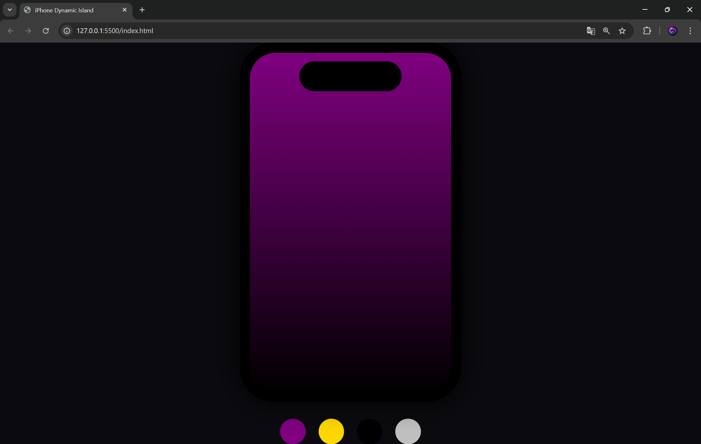

📱 iPhone Dynamic Island (HTML + CSS)
📖 Descripción

Este proyecto es una recreación visual de un iPhone con la función Dynamic Island, utilizando únicamente HTML y CSS.

Incluye animaciones, cambio de colores y una simulación interactiva de la barra dinámica (notch), inspirada en el diseño del iPhone 14 Pro.

🚀 Características
🎨 Cambio de colores (Deep Purple, Gold, Space Black, Silver)
📱 Diseño tipo iPhone con botones laterales
🎥 Cámara frontal simulada
🔲 Dynamic Island animada al hacer hover
💡 Diseño responsivo básico
⚡ Sin JavaScript (solo HTML + CSS)
🛠️ Tecnologías usadas
HTML5
CSS3 (Flexbox, Variables CSS, Animaciones)
📂 Estructura del proyecto
📁 proyecto
 ├── index.html
 └── style.css
▶️ Cómo usar
Descarga o clona este repositorio:
git clone https://github.com/tu-usuario/tu-repo.git
Abre el archivo:
index.html
Disfruta la animación en tu navegador 🚀
🎮 Cómo interactuar
Pasa el mouse sobre la Dynamic Island para expandirla
Cambia los colores usando los botones de abajo
📸 Vista previa

(Aquí puedes agregar una imagen o screenshot de tu proyecto)

💡 Posibles mejoras
Agregar funcionalidad con JavaScript (reproductor de música real)
Mejorar animaciones para que sean más similares a iOS
Hacer el diseño completamente responsivo
Añadir más interacciones táctiles
👨‍💻 Autor

# 🌍 Sitio web
https://phone-henna.vercel.app/

# 📸 imagen

Luis Orlando Flores Canizales